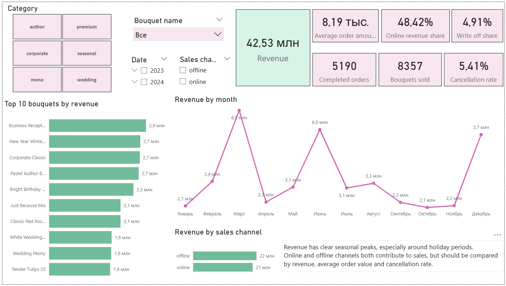
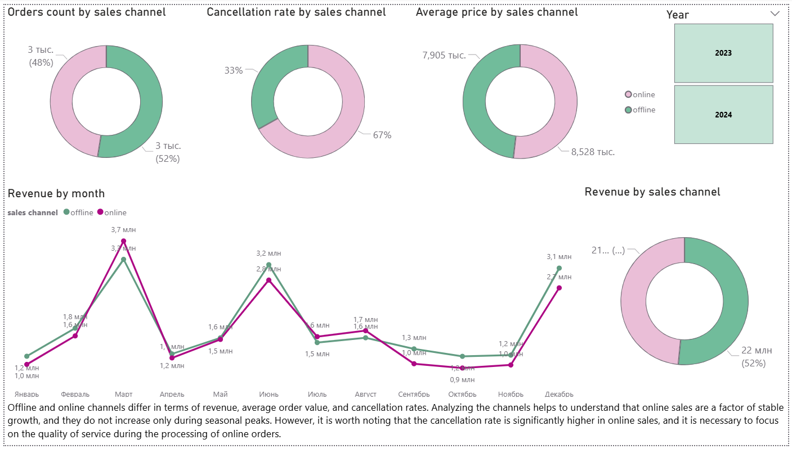
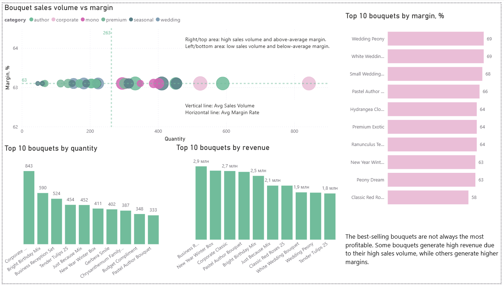
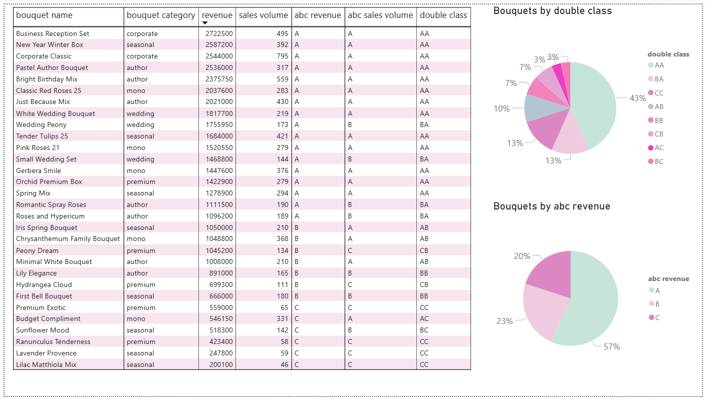
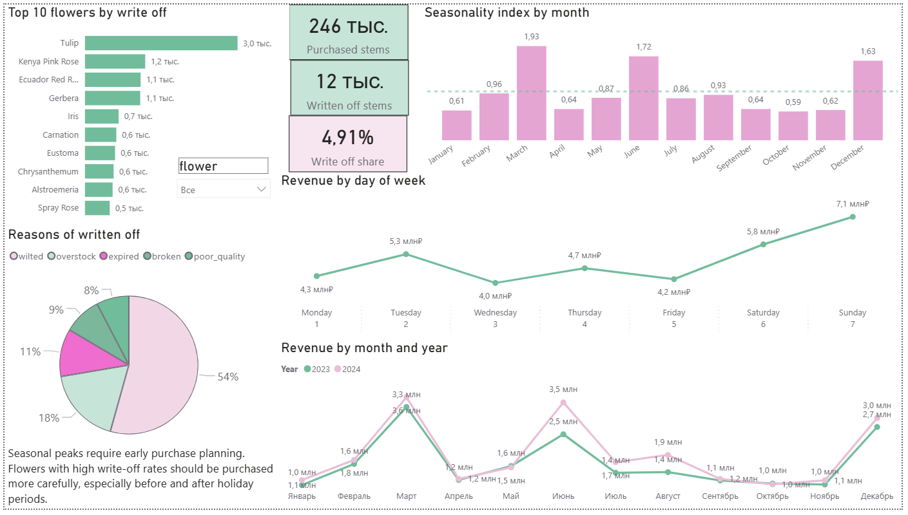
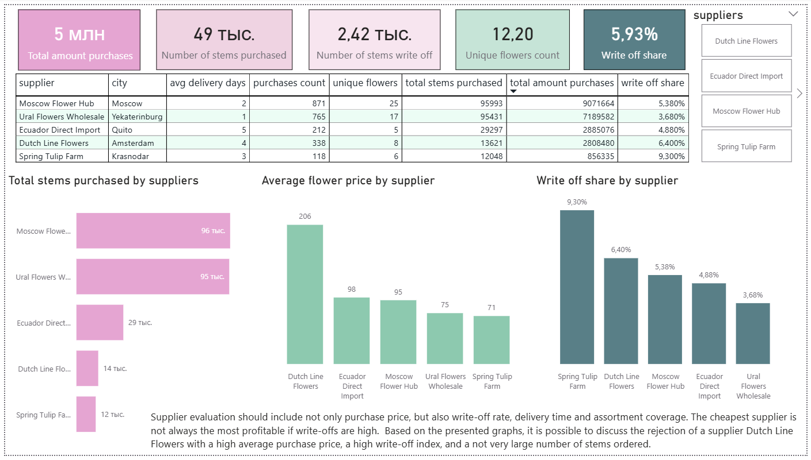

# Flower Shop Analytics / Анализ цветочного магазина 

SQL + Power BI проект по анализу продаж, маржинальности, сезонности, закупок и списаний цветочного магазина.

SQL + Power BI project to analyze sales, margins, seasonality, purchases, and write-offs for a flower shop.

## Business Problem

Цель проекта — определить, какие букеты и каналы продаж приносят прибыль, какие цветы чаще списываются, и как планировать закупки перед сезонными пиками спроса.

The project's goal is to determine which bouquets and sales channels are profitable, which flowers are most frequently written off, and how to plan purchases before seasonal peaks in demand.

## Dataset

Данные являются синтетическими и были сгенерированы для учебного проекта.  
Датасет смоделирован на основе типовых бизнес-процессов цветочного магазина: продажи, клиенты, букеты, состав букетов, поставщики, закупки и списания.
Несмотря на то, что данные искусственные, структура данных, сезонность, логика ценообразования и списаний отражают специфику флористического бизнеса.

The data is synthetic and was generated for a training project. 
The dataset is modeled based on the typical business processes of a flower shop: sales, customers, bouquets, bouquet composition, suppliers, purchases, and write-offs.
 Despite the fact that the data is artificial, the data structure, seasonality, pricing logic, and write-offs reflect the specifics of the floristry business.

## Tools

- PostgreSQL
- SQL
- Power BI
- DAX
- Power Query
- GitHub

## Project Structure

- `data/` - source CSV files
- `sql/` - SQL scripts
- `results/` - exported SQL query results
- `power_bi/` - Power BI dashboard file
- `images/` - dashboard screenshots

## SQL Analysis

The following analysis blocks are performed in the project:

- sales analysis;
- margin analysis;
- supplier analysis;
- write-off analysis;
- seasonality analysis;
- Double ABC analysis.

## Power BI Dashboard

Dashboard contains 6 pages:

1. Executive Summary
2. Sales Channels
3. Assortment & Margin
4. Double abc-analysis
5. Seasonality & Write-offs
6. Supplier Performance

# Key Findings / Основные выводы

## 1. Creating a tables

## 2. Sales Analysis / Анализ продаж

Анализ продаж показал, что выручка и средний чек букетов в разные периоды отличается. Самая высокая выручка приходится на праздники 8 марта, свадебный сезон (в основном июнь), а также на предновогодний период. При этом средний чек в самый пиковый сезон - 8 марта, довольно низкий, в отличии от свадебного сезона. Это означает, что в разные сезонные периоды необходимо делать упор на подходящие по бюджету позиции. Также было выявлено, что самые популярные по выручке и количеству заказов букеты отличаются, что означает, что самые популярные позиции не всегда являются главными по денежному вкладу: часть букетов продаётся часто за счёт более доступной цены, а часть формирует выручку за счёт высокого среднего чека.

Sales analysis has shown that the revenue and average check of bouquets differ in different periods. The highest revenue is observed during the holidays of March 8, the wedding season (mainly in June), and the pre-New Year period. However, the average check during the peak season of March 8 is relatively low compared to the wedding season. This indicates that different seasonal periods require a focus on budget-friendly products. It was also found that the most popular bouquets in terms of revenue and number of orders differ, which means that the most popular items are not always the most profitable: some bouquets are often sold due to their lower prices, while others generate revenue through higher average check sizes.

## 3. Margin Analysis

Расчёт себестоимости букетов через состав и закупочные цены показал, что выручка сама по себе не отражает реальную прибыльность ассортимента. Некоторые букеты могут давать высокий объём продаж, но иметь слабую маржинальность из-за дорогого состава или низкой розничной цены.
Анализ маржинальности по букетам позволяет выделить наиболее прибыльные позиции, на которые стоит сделать упор в продажах. Такие букеты дают бизнесу не только оборот, но и валовую прибыль. Анализ популярных, но низкомаржинальных букетов выявляет позиции, которые создают высокий поток заказов, но приносят ограниченную прибыль. Для таких букетов стоит проверить цену, состав, скидки и возможные замены дорогих компонентов.

The calculation of the cost of bouquets based on their composition and purchase prices showed that revenue alone does not reflect the actual profitability of the assortment. Some bouquets may have a high sales volume but low margins due to their expensive composition or low retail price.
Analyzing the margins of individual bouquets allows you to identify the most profitable items that should be prioritized in your sales strategy. These bouquets not only generate revenue but also contribute to the overall profitability of your business. Additionally, analyzing popular but low-margin bouquets can help you identify items that generate a high volume of orders but offer limited profit potential. For such bouquets, it is worth checking the price, composition, discounts, and possible replacements of expensive components.

## 4. Supplier Analysis

Сравнение средней закупочной цены по поставщикам и цветам показывает, что один и тот же цветок может быть выгоднее закупать у разных поставщиков.
Самый дешёвый поставщик не всегда является самым выгодным. Если у поставщика низкая цена, но высокая доля списаний, фактическая выгода может снижаться из-за потерь качества цветов. Итоговая оценка поставщиков учитывает сразу несколько факторов: закупочную цену, объём поставок, ассортимент, сроки доставки и потери от списаний. 

Comparing the average purchase price by supplier and color shows that it may be more profitable to purchase the same flower from different suppliers.
The cheapest supplier is not always the most profitable. If a supplier has a low price but a high percentage of write-offs, the actual profit may decrease due to the loss of flower quality. The final supplier rating takes into account several factors: purchase price, supply volume, assortment, delivery time, and write-off losses.

## 5. Write-off Analysis

Анализ списаний показывает, какие самый частые причины списаний цветов, в какие периоды списания происходят чаще всего.
Оценка денежных потерь от списаний показывает, как списания снижают валовую прибыль магазина. Особенно важно контролировать списания во время праздничных пиков, когда закупки резко увеличиваются, а непроданные остатки быстро теряют товарный вид.

The analysis of write-offs shows what are the most frequent causes of write-offs of flowers, in what periods write-offs occur most often.
The assessment of monetary losses from write-offs shows how write-offs reduce the gross profit of the store. It is especially important to control write-offs during holiday peaks, when purchases increase dramatically, and unsold stocks quickly lose their marketable appearance.

## 6. Seasonality Analysis

Анализ сезонности подтверждает, что спрос во флористике распределён неравномерно в течение года. Продажи усиливаются в периоды праздников и событий, когда цветы покупают как подарок или для оформления мероприятий. Сезонный индекс помогает определить месяцы, которые значительно сильнее или слабее среднего уровня продаж. Месяцы с индексом выше 1 требуют усиленного планирования закупок, персонала и обработки заказов.

Seasonality analysis confirms that demand in the floral industry is unevenly distributed throughout the year. Sales increase during holidays and events, when flowers are purchased as gifts or for event decoration. The seasonal index helps identify months that are significantly stronger or weaker than the average sales level. Months with an index above 1 require enhanced planning for procurement, staffing, and order processing.

## 7. Double ABC Analysis

В данном ABC - анализе первая буква, это объем продаж, а вторая - выручка.
### AA Высокая выручка и высокий объём продаж.
Ядро ассортимента. Эти букеты одновременно часто покупают и они дают основную выручку. Их нужно всегда держать в наличии, контролировать остатки цветов для их сборки и использовать как основу планирования закупок.
### AB Высокий объем продаж и средняя выручка.
Массовые популярные позиции с относительно невысоким чеком. Они создают поток заказов, но вклад в выручку не максимальный. Нужно проверить маржинальность: если маржа низкая, можно пересмотреть цену или состав букета.
### AC Высокий объем продаж и низкая выручка.
Очень популярные позиции, который приносят мало дохода. Потенциально проблемная зона, в которой стоит пересмотреть себестоимость букетов или поднять цену
### ВА Средний объем продаж и высокая выручка.
Сильные позиции, которые приносят хороший доход, но не особо сильно популярные. Скорее всего позиции с высоким чеком. Стоит всегда поддерживать их в ассортименте и попробовать продвигать этот товар в online
### ВВ Средний объем продаж и средняя выручка.
Стабильные позиции, которые дают хороший доход. Можно держать в ассортименте но без избытка.
### ВС Средний объем продаж и низкая выручка.
Продаются в умеренном количестве но почти не влияют на выручку.Стоит также пересмотреть маржинальность этих товаров или не делать на них акцент при закупке товара, иметь в виду как дополнительные позиции.
### СА Низкий объем продаж и высокая выручка.
Премиум сегмент или свадебные букеты. Покупаются редко, но приносят значительную выручку. Их не обязательно держать в большом объёме, но важно сохранять как имиджевый/премиальный ассортимент и предлагать под свадьбы или торжественные события.
### СВ Низкий объем продаж и средняя выручка.
Нишевые позиции. Продаются редко, но дают средний вклад в выручку, вероятно за счёт более высокой цены. Стоит проверить, в какие периоды они продаются: возможно, это сезонные или событийные букеты.
### СС Низкий объем продаж и низкая выручка.
Самое слабое звено в ассортименте. Стоит обратить внимание на них внимание, возможно удалить или перевести в разряд позиций только под заказ.

In this ABC analysis, the first letter is sales volume, and the second is revenue.
### AA High revenue and high sales volume.
The core of the product range. These bouquets are often bought at the same time and they provide the main revenue. They should always be kept in stock, the remaining flowers should be monitored for their assembly and used as the basis for purchase planning.
### AB High sales volume and average revenue.
Massive popular positions with a relatively low check. They create a flow of orders, but the contribution to revenue is not the maximum. It is necessary to check the marginality: if the margin is low, you can review the price or the composition of the bouquet.
### AC High sales volume and low revenue.
Very popular positions that generate little income. A potentially problematic area in which it is worth reviewing the cost of bouquets or raising the price
### VA Average sales and high revenue.
Strong positions that generate good income, but are not very popular. Most likely positions with a high check. You should always keep them in stock and try to promote this product online.
### VV Average sales and average revenue.
Stable positions that provide good income. You can keep it in stock but without excess.
### VC Average sales and low revenue.
They are sold in moderate quantities but have almost no effect on revenue.It is also worth reviewing the marginality of these products or not focusing on them when purchasing goods, keeping in mind as additional items.
### CA Low sales volume and high revenue.
Premium segment or wedding bouquets. They are rarely bought, but they bring significant revenue. It is not necessary to keep them in large quantities, but it is important to keep them as an premium assortment and offer them for weddings or special events.
### CV Low sales volume and average revenue.
Niche positions. They are rarely sold, but they make an average contribution to revenue, probably due to the higher price. It is worth checking in which periods they are sold: perhaps these are seasonal or event bouquets.
### CC Low sales and low revenue. 
The weakest link in the product range. It is worth paying attention to them, it is possible to remove or transfer them to the category of items only for the order.

## Power BI Dashboard

### Executive Summary

### Sales Channels

### Assortment & Margin

### Double abc-analysis

### Seasonality & Write-offs

### Supplier Performance

## How to Run

1. Create PostgreSQL database.
2. Run `sql/01_create_tables.sql`.
3. Import CSV files from `data/`.
4. Run SQL analysis scripts from `sql/`.
5. Open `power_bi/flower_shop_dashboard.pbix`.
